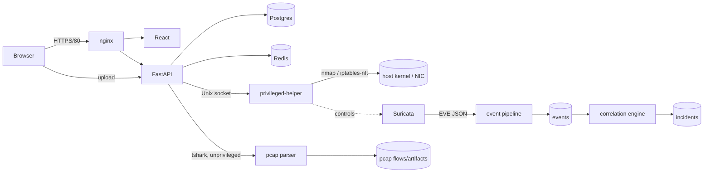

# SentinelCore

## 1. What it is

SentinelCore is a modular network detection and incident response platform:
Suricata watches a mirrored network link, a rule-based pipeline turns raw
alerts into deduplicated events and correlated incidents, and an analyst
triages, contains (firewall block with mandatory TTL), and reports on them —
with no ML/AI in the detection path, so every alert traces back to a
specific Suricata signature or correlation rule you can read. It deploys as
one `docker compose up` on a single Ubuntu host with a mirrored capture
interface — no separate sensor infrastructure to stand up.

## 2. Architecture



- **Browser → nginx → React / FastAPI**: nginx (port 80) proxies `/api/*` to
  FastAPI and everything else to the Vite-served React app.
- **FastAPI → helper (Unix socket) → nmap / Suricata control / firewall**:
  the API holds no `NET_ADMIN`/`NET_RAW` capability; every privileged
  operation (asset discovery scans, starting/stopping Suricata, applying or
  revoking firewall rules) crosses a single Unix socket to `privileged-helper`,
  the only container with those capabilities.
- **Suricata → EVE → pipeline → events → correlation → incidents**: Suricata
  writes `eve.json`; the pipeline worker tails it, normalizes and
  deduplicates into `events`, and the correlation engine groups related
  events into `incidents` an analyst triages.
- **pcap path**: uploaded captures are parsed by `tshark`/`capinfos` inside
  the unprivileged backend itself (not the helper) — see
  `backend/app/pcap/parser.py` and `updates/U03-pcap-parser-isolation.md`
  for why.

## 3. Requirements

- Ubuntu Server 24.04 (other Linux distros with Docker likely work but are
  untested).
- Docker Engine + Docker Compose v2 (`docker compose`, not `docker-compose`).
- A network interface that can see the traffic you want to monitor:
  - **VirtualBox**: attach a second adapter in **promiscuous mode
    "Allow All"** on an internal/host-only network — Suricata needs to see
    packets not addressed to the VM itself.
  - **WSL is not supported** — WSL's virtualized networking cannot present a
    real mirrored/promiscuous interface to Suricata.

## 4. Quick start

```bash
cp .env.example .env
```

Edit `.env` and set at minimum:

- `POSTGRES_PASSWORD` — anything you like for a lab deployment.
- `SECRET_KEY` — `openssl rand -hex 32`, must not be the placeholder.
- `CAPTURE_INTERFACE` — the mirrored/promiscuous interface name (`ip link`
  to list; commonly `enp0s8` in VirtualBox).
- `MONITORED_NETWORK` — the CIDR of the network you're allowed to monitor.
- `PROTECTED_IPS` — your gateway and DNS server; these plus the platform's
  own host IP can never be firewall-blocked (M10), no matter what.

Then:

```bash
docker compose up --build
```

On first boot the backend seeds a bootstrap admin account
(`scripts/seed_admin.py`): if you did not set `SEED_ADMIN_PASSWORD` in
`.env`, a strong random password is generated and printed **once** in the
`backend` container's logs (`docker compose logs backend | grep -A2 admin`).

Open **http://localhost/** (nginx on port 80) and log in as `admin` /
`SEED_ADMIN_USERNAME` from `.env`.

Default ports: `80` (nginx, the only port you should need), `127.0.0.1:5433`
(Postgres, loopback-only, for host-side `psql`/tooling). Everything else
(backend 8000, frontend 5173, the helper's Unix socket) is internal to the
Docker network and not published to the host.

## 5. Roles

| Role | Can do |
|---|---|
| viewer | Read-only: browse events, incidents, assets, reports, IOCs. |
| analyst | Everything a viewer can, plus triage/resolve incidents, run asset discovery scans, upload/analyze PCAPs, manage IOCs, generate reports. |
| admin | Everything an analyst can, plus user management, sensor control (start/stop Suricata, rule overrides), firewall containment (block/unblock), threat-intel feed configuration. |

## 6. Modules

| Module | Summary |
|---|---|
| M0 | Infrastructure: Docker Compose skeleton, Postgres, Redis, the privileged-helper container and its capability split. |
| M1 | Auth/RBAC: Argon2 password hashing, JWT access/refresh tokens, the three-role model, login throttling. |
| M2 | App shell: React/Tailwind frontend skeleton, routing, role-aware navigation. |
| [M3](Modules/M03-asset-discovery_1.md) | Asset discovery: nmap/Scapy scans via the helper, asset + port inventory. |
| [M4](Modules/M04-suricata-sensor_1.md) | Suricata sensor: rule staging, start/stop/status control through the helper, EVE log output. |
| [M5](Modules/M05-event-pipeline_1.md) | Event pipeline: tails EVE JSON, normalizes and deduplicates into the partitioned `events` table. |
| [M6](Modules/M06-search_1.md) | Search: faceted event search with cached facet counts and bounded time windows. |
| [M7](Modules/M07-correlation_1.md) | Correlation: rule-based grouping of related events into incident candidates. |
| [M8](Modules/M08-incidents_1.md) | Incidents: promotion, triage workflow, history, evidence linking. |
| [M9](Modules/M09-reporting_1.md) | Reporting: four report types, async PDF/CSV/JSON generation, admin-managed schedules. |
| [M10](Modules/M10-firewall_1.md) | Firewall containment: TTL-bounded `iptables` blocks via the helper, protected-IP guard, reconciliation. |
| [M11](Modules/M11-pcap_1.md) | PCAP analysis: upload, tshark-based flow/artifact extraction, stream follow, packet listing. |
| [M12](Modules/M12-threat-intel_1.md) | Threat intel: IOC management, feed ingestion, live traffic matching, retro-hunts. |

Follow-up upgrade work (audit-log immutability, PCAP isolation decision,
this README/CI, dashboard top-talkers, threat model, validation, and
performance measurement) is tracked in `updates/U00-INDEX.md` through
`U09-performance-footprint.md`.

## 7. Security design

- **Privilege separation**: the FastAPI backend runs as an unprivileged
  user (`appuser`, uid ≠ 0) with `cap_drop: [ALL]`. It holds no raw-socket
  or netfilter capability. Every operation that needs one — nmap scans,
  Suricata control, firewall rule changes — is sent as a typed, validated
  request over a Unix socket to `privileged-helper`, the only container
  with `NET_ADMIN`/`NET_RAW`/`SYS_NICE`/`CHOWN` (never `privileged: true`).
- **TTL-only firewall blocks**: every firewall action carries a mandatory
  time-to-live (60 s – 24 h); nothing can be blocked permanently, and a
  reconciliation loop keeps the kernel's rule set in sync with the database.
- **Protected IPs**: the configured gateway, DNS server(s), and the
  platform's own host address can never be blocked, no matter who asks or
  how — enforced in `helper/helper/guards.py`, independent of the API layer.
- **Append-only audit trail**: every write action is logged to `audit_log`,
  which the database itself refuses to `UPDATE`/`DELETE`/`TRUNCATE` (even
  for the table owner), plus a SHA-256 hash chain for tamper evidence — see
  `docs/threat-model.md`.

## 8. Testing

- **Unit tests**: `docker compose exec backend python -m pytest` (backend),
  `docker compose exec helper python -m pytest` (helper's validation/guard
  logic).
- **`scripts/e2e_test.py`**: full-platform end-to-end suite against a
  running stack — logs in over the real `/auth/login` endpoint, drives
  every module's HTTP API, and checks the CLAUDE.md architecture
  invariants. Run with `docker compose exec backend python -m scripts.e2e_test`.
- **`scripts/e2e_browser.py`**: browser-driven smoke test of the frontend
  through the real nginx path.

## 9. Lab-only warning

SentinelCore actively scans and can actively block hosts. **Only run asset
discovery, vulnerability checks, or firewall containment against networks
and hosts you own or have explicit written authorization to test.**
`MONITORED_NETWORK` scopes what the platform will act on, but that setting
is only as good as what you point it at — never point it at college,
employer, or third-party infrastructure.

## 10. Team, mentors, licence

Developed by Dhruv Patel and Nisarg Dedakiya. Licence: not yet specified —
treat this repository as All Rights Reserved until a `LICENSE` file is
added.
