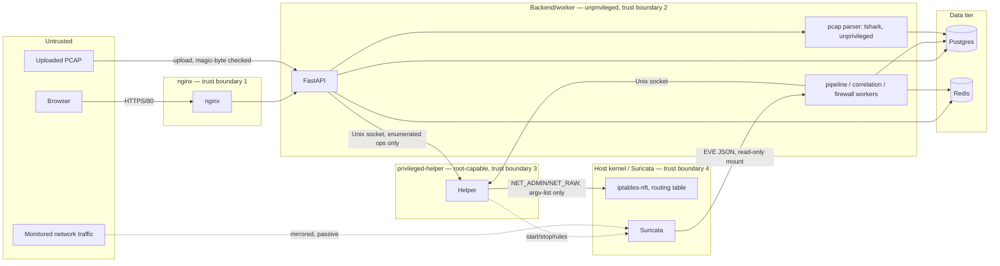

# SentinelCore threat model

Every control cited below was verified directly in the code at the commit
this document was written against (branch `dhruv`, U02–U05 merged) — file
paths and line numbers are given so a reviewer can check them without
trusting this document. Where no control was found, the row says **GAP**
rather than being omitted.

## 1. Scope and assumptions

- Single Linux host (Ubuntu Server 24.04 in the reference deployment),
  Docker Compose, all containers on one bridge network (`sentinelcore-network`)
  except `helper`, which uses `network_mode: host`.
- The monitored network is an isolated lab/internal network; the capture
  interface is mirrored/promiscuous (VirtualBox "Allow All" or equivalent).
- The physical host and the Docker daemon are trusted — this model does not
  defend against an attacker who already has root on the host or access to
  the Docker socket.
- Suricata sees traffic passively; it does not sit inline. Nothing in this
  platform can prevent a packet from being delivered, only detect and react
  after the fact (contrast with an inline IPS).
- Single-tenant: one deployment, one organisation's network. No multi-tenant
  isolation is modelled.

## 2. Assets to protect

| Asset | Where it lives |
|---|---|
| Network map / asset inventory | `assets`, `asset_ports` tables |
| Event and incident data | `events` (partitioned), `incidents`, `incident_history` |
| Credentials and the JWT signing secret | `users.password_hash` (Argon2), `SECRET_KEY` env var |
| Firewall control path | Unix socket to `privileged-helper`; `firewall_actions` table |
| Audit trail | `audit_log` (append-only, hash-chained — see §6 T09) |
| Uploaded PCAPs | `pcap_storage` volume; may contain credentials or sensitive payloads captured from real traffic |
| Generated report files | `report_storage` volume (PDF/CSV/JSON) |
| Threat-intel indicators | `ioc`, `ioc_sources` tables |

## 3. Adversaries

- **(a) Unauthenticated network attacker** reaching the web UI (nginx, port 80) or any other exposed surface.
- **(b) Malicious or low-privilege authenticated user** (viewer/analyst) attempting to escalate privilege or reach admin-only actions.
- **(c) Attacker-controlled traffic and PCAP contents** processed by Suricata, the event pipeline, and the PCAP parser — the platform ingests hostile input by design.
- **(d) Compromised backend process** (e.g. via a dependency CVE or the PCAP parser, see T10) — assume RCE as `appuser`, no root, no `NET_ADMIN`/`NET_RAW`, no capabilities.
- **(e) Insider admin** abusing legitimate containment/scan capability (e.g. blocking an innocent host, scanning out-of-scope infrastructure).

## 4. Data-flow diagram

Trust boundaries, outer to inner: **browser** (fully untrusted) → **nginx**
(TLS/reverse-proxy termination, no application logic) → **backend/worker**
(unprivileged, `cap_drop: ALL`, holds application logic and parses
attacker-controlled PCAPs) → **Postgres/Redis** (reachable only from the
Docker-internal network, no host port except Postgres on loopback for
tooling) → **privileged-helper** (the only root-capable, `NET_ADMIN`/`NET_RAW`
component, reachable only via a Unix socket with an enumerated op set) →
**host kernel/Suricata** (only the helper touches these directly).

## 5. Attack surface

| Surface | Detail | Exposure |
|---|---|---|
| nginx port 80 | Only host-published web port | Internet/LAN-facing if the host is reachable |
| Postgres port 5433 | `127.0.0.1:5433:5432` | Loopback-only, host-side tooling |
| Backend port 8000 | `expose` only (no host port) | Docker-internal only |
| Frontend port 5173 (Vite) | `expose` only | Docker-internal only |
| Helper Unix socket | `/run/sentinelcore/helper.sock`, 0660 `root:sentinelcore` | Reachable only by containers in the `sentinelcore` group (backend, worker) |
| `/api/auth/*` | Login, refresh, logout | Unauthenticated (login/refresh by design) |
| `/api/users/*`, `/api/audit/*` | User mgmt, audit verify | Admin-only |
| `/api/assets/*`, `/api/sensor/*` | Discovery scans, Suricata control | Admin/analyst, routed through helper |
| `/api/events/*`, `/api/stats/*`, `/api/correlation/*`, `/api/incidents/*` | Search, dashboard, triage | Any authenticated role (read), analyst+ (write) |
| `/api/firewall/*` | Containment actions | Admin-only, TTL-mandatory |
| `/api/pcap/*` | Upload + analysis | Analyst+ upload, admin-only raw download |
| `/api/intel/*` | IOC/feed management | Analyst can add IOCs, admin manages feed sources |
| `/api/reports/*` | Report generation/download | Owner or admin only |
| Uploaded PCAP files | Attacker-controlled binary input | Parsed by tshark as `appuser`, see T10 |
| Suricata's mirrored interface | Raw network traffic | Passive; processed by Suricata + the event pipeline |
| Admin config (`.env`, `PROTECTED_IPS`, `MONITORED_NETWORK`) | Deployment-time trust input | Operator-controlled, not attacker-reachable |

## 6. Threat table (STRIDE)

Likelihood/Impact scale: **1** = unlikely/minor, **2** = plausible/moderate,
**3** = likely or trivial to attempt / severe (data loss, RCE, full
containment bypass).

| ID | Threat | Component | STRIDE | L | I | Control implemented | Test | Residual risk |
|---|---|---|---|---|---|---|---|---|
| T01 | Command injection via scan target/params | `privileged-helper` | Tampering | 2 | 3 | `helper/helper/validation.py:37-89` `validate_target()` restricts input to a numeric-IP/CIDR regex before `ipaddress.ip_network()` parsing and enforces `subnet_of(monitored)`; `validate_ports()` (136-173) is a strict digit/range regex. `helper/helper/executor.py:70-91` `run()` calls `subprocess.run(argv, shell=False, ...)` with an absolute-path check on `argv[0]`. No `shell=True` anywhere in the repo (`backend/tests/test_no_subprocess.py`). | `helper/tests/test_validation.py` | A validator bug that accepts a crafted-but-technically-valid IP/CIDR string is still bounded to argv-list execution — no shell metacharacter can ever reach a shell, since none is ever spawned. |
| T02 | Web tier compromise escalates to root | backend container | Elevation of privilege | 2 | 3 | Backend/worker run as `appuser` (uid 1000, `backend/Dockerfile`), `cap_drop: [ALL]`, `security_opt: no-new-privileges:true` (`docker-compose.yml:112-115, 154-157`). No raw-socket capability; the only path to privileged operations is the helper's enumerated op set over a Unix socket. | `scripts/e2e_test.py` invariant "API process does not run as root" | A backend RCE still runs as an unprivileged, capability-dropped user with no route to the helper socket's privileged ops beyond what the API itself already exposes — bounded by T03's controls. |
| T03 | Helper asked to run arbitrary code | `privileged-helper` | Elevation of privilege | 1 | 3 | Fixed, enumerated op table (`helper/helper/ops/`), each op independently validated server-side (not trusting the caller's claim of having validated). Every call is logged with the requester. No "run this command" op exists — only named, parametrized operations (`fw_apply`, `suricata_write_rules`, `vuln_nikto`, etc. per module). | `helper/tests/test_*_ops.py` per module | A backend compromise can still invoke any *legitimate* helper op with attacker-chosen (but validated) parameters — e.g. block an arbitrary in-scope, non-protected IP. This is contained by T04/T05's guards, not eliminated. |
| T04 | Blocking the gateway/DNS/self (self-DoS) | `helper/helper/guards.py` | Denial of service | 2 | 3 | `is_protected()` (`guards.py:183-205`) checks CIDR **overlap**, not exact match, against: `read_gateways()` (41-60, parsed live from `/proc/net/route`, not config), `read_dns_servers()` (63-83, from `/etc/resolv.conf`), `read_host_ips()` (86-115, live interface enumeration), and the configured `PROTECTED_IPS`. Gateway/DNS detection is kernel/OS-derived, not trusted config alone. | `helper/tests/test_guards.py` | If the host's routing table or `/etc/resolv.conf` is wrong at boot (e.g. static config drift), the derived protection set is only as good as that state. Mitigated by also including the operator-configured `PROTECTED_IPS`. |
| T05 | Permanent or forgotten firewall blocks | `firewall_actions`, `services/firewall.py` | Denial of service | 2 | 2 | `TTL_MIN_SECONDS = 60`, `TTL_MAX_SECONDS = 86400` (`backend/app/models/firewall_action.py:31-32`) plus a DB `CHECK` constraint (`ck_firewall_actions_ttl_bounds`) so even a direct-SQL insert cannot bypass it. `run_expiry_pass()`/`run_expiry_loop()` (`services/firewall.py:227-275`) revoke expired rules; `reconcile()` (278-334) fixes kernel/DB drift in both directions. | `backend/tests/test_firewall.py` (TTL bounds via schema **and** direct DB insert; reconcile drift tests) | If the expiry worker itself is down for an extended period, expired-but-not-yet-revoked rules remain live in the kernel until it recovers — bounded by whatever monitoring alerts on worker health (outside this platform). |
| T06 | Credential stuffing / brute force on login | `login_throttle.py`, `routes/auth.py` | Elevation of privilege | 3 | 2 | Redis-backed throttle keyed on `sha256(username\|ip)` (`login_throttle.py:18-21`), `login_max_attempts`/`login_lockout_seconds` from config. Argon2 hashing (`core/security.py:18`, `argon2-cffi`). Unknown usernames still run `verify_password` against a dummy hash for constant-time behaviour, and return the same generic failure as a wrong password (`routes/auth.py:109-121`) — no username enumeration via response shape or timing. | (throttle/hashing logic; RBAC-style unit coverage) | Throttle is per `(username, ip)` — a distributed attacker rotating source IPs against one username is not additionally slowed beyond Argon2's inherent cost. Acceptable for a single-organisation lab/SOC deployment; would need a global-per-username counter for internet-facing use. |
| T07 | Token theft/replay, forged JWT | `core/security.py`, `api/deps.py` | Spoofing | 2 | 3 | HMAC-signed JWTs (`_encode`/`decode_token`, `security.py:47-99`) with a `type` claim (access vs refresh cannot be swapped). 15 min access / 7 day refresh TTLs (`config.py:13-14`). `tokens_valid_from` on the user row (`models/user.py:57`) invalidates all tokens issued before a logout/password/role change; enforced on every request (`api/deps.py:56-64`). | `backend/tests/test_security.py`, `test_rbac.py` | A stolen access token is usable for up to 15 minutes (by design — short-lived) unless the user's `tokens_valid_from` is bumped first; refresh tokens are httpOnly-cookie scoped (`path=/api/auth`), not exposed to JS. |
| T08 | Privilege escalation between roles | `api/deps.py`, frontend routing | Elevation of privilege | 2 | 3 | `require_role()` (`api/deps.py:72-90`) is the single authorization chokepoint for every mutating/admin route; admin is never implicitly included in a role list, it must be named explicitly (deliberate — makes every call site auditable by reading it). Frontend `ProtectedRoute.jsx:27-40` mirrors this but is explicitly documented as UX-only, not the real boundary. | `backend/tests/test_rbac.py` (matrix per role); `scripts/e2e_test.py` RBAC checks per module | The frontend guard can always be bypassed by calling the API directly — by design, since the backend is the actual enforcement point and is tested as such. |
| T09 | Audit log tampering / repudiation | `audit_log` | Repudiation | 1 | 3 | Append-only trigger (`audit_log_block_mutation`, migration `0012_audit_immutable.py`) rejects UPDATE/DELETE/TRUNCATE for every DB role including the table owner — verified empirically that a plain `REVOKE` alone does **not** stop an owner in Postgres, so the trigger is the real enforcement. SHA-256 hash chain (`prev_hash`/`row_hash`, `services/audit.py::record`) gives tamper evidence if a superuser disables the trigger; `GET /api/audit/verify` (admin-only) walks the chain. | `backend/tests/test_audit_immutable.py`; `scripts/e2e_test.py` invariant | A superuser who disables the trigger **and** rewrites every downstream hash consistently can forge an internally-consistent chain — proves internal consistency, not ground truth. Full DB-host compromise is out of scope (§7). |
| T10 | Malicious PCAP (dissector bugs, zip bombs, path traversal) | `pcap/parser.py` | Tampering / DoS | 3 | 2 | Magic-byte check + UUID-based storage filename (path traversal in the *display* filename never reaches the disk path), sha256 dedup, argv-list `tshark`/`capinfos` calls with `-n` (no name resolution), wall-clock timeout, CPU/address-space rlimits (`_limit_resources`), runs as unprivileged `appuser` with no path to the helper socket. Deliberately **not** in the privileged helper — see U03 analysis. | M11 e2e checks (path traversal, sha256 dedup, admin-only raw download); `backend/tests/test_no_subprocess.py` | A tshark dissector 0-day still yields code execution as `appuser` inside the backend container — no root, no `NET_ADMIN`/`NET_RAW`, `cap_drop: ALL`, no socket to the helper. Bounded to "backend container compromise" (T02), not host or containment-path compromise. |
| T11 | Secrets in repo/config | repo, `.env` | Information disclosure | 1 | 3 | `.env` is gitignored and confirmed untracked (`git ls-files .env` empty, checked by CI and `e2e_test.py`); `.env.example` documents every variable with no real secret. `e2e_test.py:868-870` asserts `SECRET_KEY` at runtime is not the shipped placeholder. | `scripts/e2e_test.py` invariant; CI `guardrails` job (U04) | A misconfigured deployment that never edits `SECRET_KEY` away from the placeholder is caught by the invariant check, but only if someone runs it — not enforced at container startup (an improvement, not currently a hard refusal-to-boot). |
| T12 | Stored XSS via alert/signature/hostname text | frontend, report templates | Tampering | 1 | 2 | React's default JSX escaping; `dangerouslySetInnerHTML` does not appear anywhere in `frontend/src` (grepped, zero matches). Report HTML generation uses Jinja2 with `autoescape=select_autoescape(["html"])` (`backend/app/reports/render.py`) and nothing marked `\|safe`. | Manual grep verification (above); no dedicated automated test currently | No dedicated regression test pins "no `dangerouslySetInnerHTML` is ever added" — a future PR could introduce one without a test failing. **GAP**: add a guard test (grep-based, like `test_no_subprocess.py`) asserting this. |
| T13 | Poisoned threat-intel feed / IOC injection | `intel/normalize.py`, `intel/matcher.py` | Tampering | 2 | 2 | Private/RFC1918/loopback/link-local/multicast/unspecified addresses are rejected as IOCs (`intel/normalize.py:78-91`). Severity never downgrades an already-higher-severity event: `_escalate()` (`intel/matcher.py:41-42, 237`). Feed sources are admin-only to create/edit (`api/routes/intel.py:349-429`, `require_role("admin")` on every source-management route). | M12 e2e checks (private IP refused, no-downgrade) | **GAP (partial)**: no explicit URL/domain allow-list restricts *which* external hosts an admin-configured feed source may point to — the control here is "admin-only to configure", not "restricted to known-good sources". An admin who is tricked into adding a malicious feed URL can inject arbitrary attacker-chosen IOCs (bounded by the private-IP rejection and no-downgrade rule, but not prevented). |
| T14 | Event flood / resource exhaustion | `pipeline/tailer.py` | Denial of service | 2 | 2 | Redis Stream capped at `STREAM_MAXLEN = 500_000` so a stalled consumer cannot exhaust Redis memory; batched reads (`BATCH_LINES = 500`) and a per-line size cap (`MAX_LINE_BYTES = 1MB`). `events` is time-partitioned with `retention.py` dropping whole partitions (instant, no bulk-DELETE bloat). Indexes support the query patterns used under load (see U09 measurement). | U09 performance/throughput measurement (tooling; run in the lab, not CI) | **GAP (partial)**: the bounded stream and partition-drop retention are evidence of *buffering*, not a formal backpressure/rate-limit mechanism — at sustained extreme ingest rates the actual breaking point (Suricata capture, Redis, the writer, or Postgres) is an empirical question answered by U09's measurement tooling, not a guarantee from the code alone. |
| T15 | Report/PCAP download of another user's files | `routes/reports.py`, `routes/pcap.py` | Information disclosure | 2 | 2 | `_get_owned_report()` (`reports.py:219-225`) rejects any non-owner, non-admin access with 403. `pcap.py:332-333` mirrors this for PCAP metadata; raw-capture download is additionally gated `require_role("admin")` regardless of ownership (`pcap.py:348`), since a raw PCAP may contain more than the uploader intended to share. | M9/M11 e2e ownership checks | None beyond normal RBAC risk (a compromised admin account can read everything — inherent to the role, see T08/§7). |
| T16 | Container breakout / excess capabilities | `docker-compose.yml` | Elevation of privilege | 1 | 3 | Only `helper` holds `NET_ADMIN`/`NET_RAW`/`SYS_NICE`/`CHOWN` (each justified inline in `docker-compose.yml:65-76`), never `privileged: true`. Backend and worker both `cap_drop: [ALL]` + `no-new-privileges:true` (lines 112-115, 154-157). | `scripts/e2e_test.py` invariant (uid check); manual compose review | **GAP**: no service sets `read_only: true` on its root filesystem — a container-breakout-adjacent bug (e.g. arbitrary file write inside the container) is not blocked by a read-only rootfs the way U03's proposed `pcap-worker` design called for. Worth adding for `backend`/`worker` at minimum; `helper` needs write access for rule staging so is a harder case. |
| T17 | Scanning third-party infrastructure | `api/routes/assets.py`, `helper/helper/validation.py` | Denial of service (to a third party) | 2 | 3 | Two independent layers: the backend defaults/limits scan targets to `settings.monitored_network_parsed` (`assets.py:63`), **and** independently the helper's `validate_target()` (`validation.py:82-87`) rejects any target outside the monitored network regardless of what the backend sends — defense in depth against a compromised or buggy backend, not reliance on a single check. | `helper/tests/test_validation.py` (out-of-scope target rejected) | An admin who reconfigures `MONITORED_NETWORK` to include infrastructure they don't actually control removes this protection entirely — a deployment-time trust decision, not something code can prevent (documented in the README's lab-only warning). |

## 7. Out of scope / accepted risk

- **Encrypted traffic payload inspection.** TLS payloads are opaque to
  Suricata beyond metadata (SNI, JA3-style fingerprinting if configured,
  certificate details). This is a fundamental limit of passive network
  monitoring, not a bug.
- **Physical access to the host.** Anyone with physical or hypervisor-level
  access to the machine running Docker has already won.
- **Host OS compromise.** If the Linux kernel or Docker daemon itself is
  compromised, every container-level boundary in this document is moot.
- **DoS from very high traffic volume.** The actual throughput ceiling
  (Mbps and events/s before drops) is an empirical finding, not a design
  guarantee — measured in U09 (`validation/perf/`).
- **Suricata's own detection accuracy.** This threat model covers the
  *platform around* Suricata; whether a given attack technique triggers an
  alert at all is a ruleset question, covered by U08's validation lab, not
  by this document.

## 8. Review log

| Date | Who | Change |
|---|---|---|
| 2026-09-29 | Claude (U02) | Added the Repudiation row (T09) after implementing append-only `audit_log`. |
| 2026-09-29 | Claude (U07) | Wrote the full document: scope, assets, adversaries, DFD, attack surface, complete STRIDE table (T01–T17) with every control verified against the code, four explicit GAPs recorded (T12 no XSS regression guard, T13 no feed-source allow-list, T14 buffering-not-backpressure, T16 no `read_only` rootfs). |
